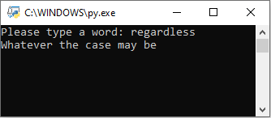
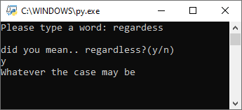

# English_Dictionary
 
This program accepts a string as an input, for an english word and returns that words value based on a Json file containing words an meenings.

If the word is not found due to a typo, I also implemented a sugestion based on the closest matching result in our Json.

